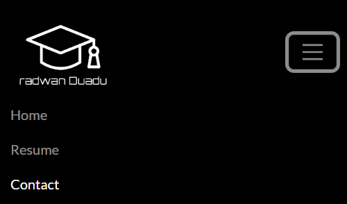
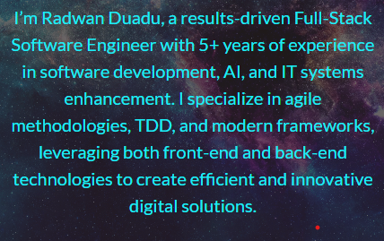
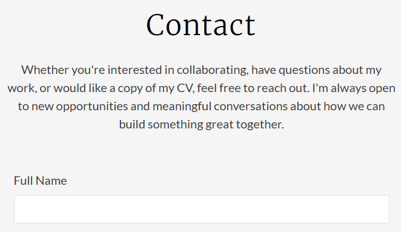
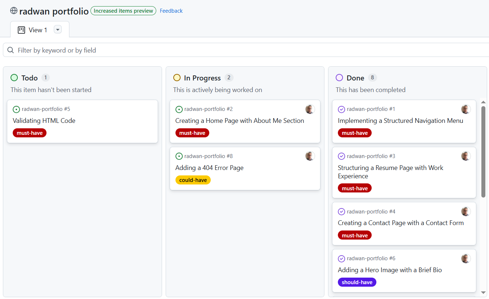

# [radwan-portfolio](https://radwanduadu.github.io/radwan-portfolio)

The portfolio website is a comprehensive online platform designed to showcase my professional and personal skills, experience, and accomplishments. The primary objective of this project is to create a centralized hub where potential employers, clients, and collaborators can access information about my background, expertise, and body of work.

### Goals and Objectives
The ultimate goal of this project is to establish a strong online presence that showcases my skills, experience, and personality. By achieving this goal, I hope to:

- Increase visibility and credibility in my field
- Attract new opportunities, collaborations, and clients
- Foster meaningful connections with like-minded professionals and peers
- Continuously improve and refine my skills and services based on user feedback and engagement

source: [radwan-portfolio amiresponsive](https://ui.dev/amiresponsive?url=https://radwanduadu.github.io/radwan-portfolio)

## UX

### The 5 Planes of UX

#### 1. Strategy Plane
##### Purpose
- The purpose of the portfolio website is to showcase my professional skills, experience, and personality.
- Provide a seamless user experience that encourages users to learn more about me and potentially collaborate or hire me.

##### Primary User Needs
- Learn about my background, skills, and experience.
- Access responsive, user-friendly content that showcases my work and accomplishments.
- Get in touch with me directly through a contact form or other means.

##### Business Goals
- Establish myself as a credible and skilled professional in my field.
- Increase visibility and attract new opportunities, collaborations, and clients.
- Foster meaningful connections with like-minded professionals and peers.

#### 2. Scope Plane
##### Scope Features
- A full list of **[Features](#features)** can be viewed in detail below.

##### Content Requirements
- Clear, motivational text about my professional journey and aspirations.
- Photos and visuals that showcase my work and personality.
- Detailed descriptions of my projects and experiences.
- Forms for direct contact and inquiries.

#### 3. Structure Plane
##### Information Architecture
- **Navigation Menu**:
  - Accessible links in the navbar.
- **Hierarchy**:
  - Clear call-to-action buttons.
  - Prominent placement of social media links in the footer.

##### User Flow
1. User lands on the home page → learns about my professional background and mission.
2. Navigates to the projects/skills section → sees examples of my work and expertise.
3. Views the about page → checks my bio and contact information.
4. Submits an inquiry or request for collaboration through the contact form or email link.
5. Browses the hobbies section → explores my personal interests and opens links to public websites to learn more about these hobbies.

#### 4. Skeleton Plane
##### Wireframe Suggestions
- A full list of [Wireframes](#wireframes) can be viewed in detail below.

#### 5. Surface Plane
##### Visual Design Elements
- **[Colours](#colour-scheme)**: see below
- **[Typography](#typography)**: see below

### Colour Scheme

I utilized the capabilities of ChatGPT to generate a dark color palette for a modern portfolio website. By providing the website link, I was able to extract the existing color scheme and create a new palette that complements the dark theme. The resulting palette features a range of deep blues and purples, perfect for creating a sophisticated and modern look.

To enhance the user experience, I also made adjustments to the resume section by implementing a lighter and brighter background. This design choice significantly improves readability, making it easier for visitors to scan and review my professional experience and skills. With ChatGPT's assistance, I was able to achieve a cohesive and visually appealing design that balances style and functionality.

* still to change are all rgb values to hex vales all white or silver to hex value *

- `#000000` (Black) navbar background colour.
- `#3a3a3a` (Eclipse) primary text colour.
- `#16213e` (Blue Whale) background colour for resume and contact page.
- `#08fcf8` (Aqua) page headers. 
- `#C0C0C0` (silver) home page header.
- `#F5F5F5` (white smoke) about & work experience section background colour.
- `#1a1a2e` (Midnight Express) about section h2 header.
- `#dbdcde` (Athens Grey) portfolio and hobbie background colour.
- `#1f7798` (Allports) bootstrap card titles.
- `#f8f9fa` (Solitude) skills section background colour.
- `#98EB95` (middle washed purple) social network icon colur.
- `#333333` (Gondola) skills title size.
- `#1aeef6` (Turquoise) header colour.

### Typography

- [Merriweather](https://fonts.google.com/specimen/Merriweather) was used for the primary headers and titles.
- [Lato](https://fonts.google.com/specimen/Lato) was used for all other secondary text.
- [Font Awesome](https://fontawesome.com) icons were used throughout the site, such as the social media icons in the footer.

## User Stories

| Target | Expectation | Outcome |
| --- | --- | --- |
| As a visitor |  I want to learn about the portfolio owner on the homepage so that I can understand their background and expertise | The home page includes an About Me section with a brief bio and an engaging introduction |
| As a Visitor |  I need easy navigation and a user-friendly design, including a responsive layout for my device, so I can find information quickly and efficiently without frustration. | Site layout and navigation are intuitive, allowing easy access to different sections. |
| As a Visitor | I want to view the portfolio owner's resume, including work experience, so that I can assess their qualifications. | The Resume page includes past work experience, education, and relevant skills. |
| As a Visitor | I want to contact the portfolio owner through a contact form so that I can reach out for potential opportunities. | The contact page includes a contact form with fields for name, email, and message. |
| As a Visitor |  I want to see a visually appealing hero image with a short one-sentence bio so that I can quickly understand who the portfolio owner is. | A high-quality hero image is displayed prominently, and a brief bio is visible on the home page. |
| As a Visitor | I want to see a footer on all pages containing social media icons that link to the portfolio owner's external profiles so that I can connect with them on different platforms. | The footer includes social media icons that open in new tabs and display correctly on all screen sizes with appropriate alt text. |
| As a Visitor | I want to see the portfolio owner's completed projects so that I can evaluate their work and explore it further. | The Resume page includes a section that showcases projects in card format, each containing an image, title, and short description. Clicking the card redirects to the project's GitHub or live site. |
| As a Visitor | I want to learn about the portfolio owner's hobbies so that I can connect with their interests and explore more about them. | The website features a hobbies section with individual cards that display a title or summary, link to external websites for more information, and are styled consistently and responsively across all screen sizes. |
| As a Visitor | I want to view the portfolio owner's technical skills and tools in the Contact section so that I can quickly assess their areas of expertise before reaching out.| The Contact section includes a visually styled skills grid with icons and labels to display the user's key technologies (e.g., HTML, CSS, JavaScript, Bootstrap, Git, GitHub, etc.).|
| As a Visitor | I want to be redirected to a custom 404 page when I enter a non-existent URL so that I receive a relevant and personal message instead of a default error page. | A custom 404.html page exists and provides a personal message with navigation options. |
| As a Devloper | I want my HTML code to pass the W3C validation with no issues so that I ensure proper coding standards. | No validation errors in the Validator for CSS code. No validation errors in the Validator for HTML code. |
| As a Visitor | x | Y |
| As a Visitor | x | Y |

## Wireframes

To follow best practice, wireframes were developed for mobile, tablet, and desktop sizes.
I've used [Balsamiq](https://balsamiq.com/wireframes) to design my site wireframes.

| Page | Mobile | Tablet | Desktop |
| --- | --- | --- | --- |
| Home |  |  |  |
| Resume |  |  |  |
| Contact |  |  |  |
| Confirmation |  |  |  |
| 404 |  |  |  |

## Features

I've taken the initiative to enhance my project by incorporating additional features that go beyond the original requirements. These value-added elements were carefully considered and implemented to create a more seamless and engaging user experience, ultimately resulting in a more polished and professional final product.

### Existing Features

| Feature | Notes | Screenshot |
| --- | --- | --- |
| Navbar | Featured on all three pages, the full responsive navigation bar includes links to the Logo, Home page, Resume page, and Contact page, and is identical in each page to allow for easy navigation. On the smallest screens, a burger icon is used to toggle the navbar so it doesn't take up too much space. This section will allow the user to easily navigate from page to page across all devices without having to revert back to the previous page via the "back" button. The navbar is also fixed, so it stays in view even if the user has scrolled to the bottom of the page. |  |
| Hero Image | The landing includes a photo with a text-overlay bio that provides a brief summary of my portfolio, allowing visitors to quickly understand the focus and scope of my work. This section introduces the user to Radwan's portfolio with an eye-catching background image that grabs visitor attention and sets the tone for the rest of the site. |  |
| Portfolio bio | The bio section will allow the user to see the benefits of working with me, a results-driven Full-Stack Software Engineer with 5+ years of experience in software development, AI, and IT systems enhancement. The user will see the value of collaborating with me, leveraging my expertise in agile methodologies, TDD, and modern frameworks to create efficient and innovative digital solutions. |  |
| About Section | This section will allow the user to see exactly what I do as a Software Engineer, where my expertise lies, and how long I've been in the industry. The type of technologies I specialize in (Java, Python, JavaScript, etc.) is also shown, to help users understand my skills and experience. This section will provide an overview of my background, education, and career goals, keeping the user up to date on my professional profile. |  |
| Footer | The footer includes links to the relevant social media sites for **Radwan Duadu**. The links will open in a new tab to allow easy navigation for the user. The footer is valuable to the user, as it encourages them to keep connected via social media. |  |
| Work Experience | The Work Experience feature provides a comprehensive overview of an individual's professional background, including a timeline, company information, and a summary of job roles, responsibilities, achievements, and relevant skills. This feature enables users to showcase their work experience in a clear and concise manner, making it easier for others to understand their professional background and achievements. |  |
| Contact | The Contact feature provides a simple and convenient way for visitors to get in touch with Radwan Duadu, including a contact form that allows users to send a message directly via email. |  |
| Hobbies | The Hobbies feature showcases Radwan Duadu's personal interests and passions outside of work, highlighting three unique hobbies through Bootstrap cards with images and brief descriptions. Allowing visitors to learn more about Radwan's interests and passions. |  |
| Skills | The Skills feature showcases Radwan Duadu's technical expertise and proficiency in various programming languages and tools, highlighting his skills through Bootstrap cards with icons and brief descriptions. Each skill card includes a percentage or level of proficiency, allowing visitors to quickly understand Radwan's strengths and capabilities. |  |
| Project Portfolio | The Project Portfolio feature showcases Radwan Duadu's previous work and accomplishments, highlighting three completed projects through Bootstrap cards with images, brief descriptions, and links to the project's GitHub page or website. Each project card provides a glimpse into Radwan's problem-solving skills, technical expertise, and ability to deliver results, allowing visitors to explore his work in more detail. |  |
| 404 | The 404 error page will indicate when a user has somehow navigated to a page that doesn't exist. This replaces the default GitHub Pages 404 page, and ties-in with the look and feel of the *Love Running* site by using the standard navbar and footer. |  |

### Future Features

- **Testimonials & Reviews**: Include a section for client testimonials and reviews, allowing users to showcase their reputation and credibility.
- **Blog & Insights**: Introduce a blog section where users can share their industry insights, experiences, and knowledge, establishing themselves as thought leaders in their field.
- **Training Plans**: Offer customizable training plans for runners of all levels (beginner, intermediate, advanced) with notifications and reminders.
- **Certifications & Awards**: Add a section for showcasing certifications, awards, and other recognition received by the user, such as industry certifications or design awards.
- **Video Portfolio**: Allow users to upload and showcase video content, such as explainer videos, animations, or live-action footage, to demonstrate their creative skills.

## Tools & Technologies

| Tool / Tech | Use |
| --- | --- |
|  | Generate README and TESTING templates. |
|  | Version control. (`git add`, `git commit`, `git push`) |
|  | Secure online code storage. |
|  | Local IDE for development. |
|  | Main site content and layout. |
|  | Design and layout. |
|  | Hosting the deployed front-end site. |
|  | Creating wireframes. |
|  | Icons. |
|  | Help debug, troubleshoot, and explain things. |

## Agile Development Process

### GitHub Projects

[GitHub Projects](https://www.github.com/RadwanDuadu/radwan-portfolio/projects) served as an Agile tool for this project. Through it, EPICs, User Stories, issues/bugs, and Milestone tasks were planned, then subsequently tracked on a regular basis using the Kanban project board.

### GitHub Issues

[GitHub Issues](https://www.github.com/RadwanDuadu/radwan-portfolio/issues) served as an another Agile tool. There, I managed my User Stories and Milestone tasks, and tracked any issues/bugs.

| Link | Screenshot |
| --- | --- |
|  |  |
|  |  |

### MoSCoW Prioritization

I've decomposed my Epics into User Stories for prioritizing and implementing them. Using this approach, I was able to apply "MoSCoW" prioritization and labels to my User Stories within the Issues tab.

- **Must Have**: guaranteed to be delivered - required to Pass the project (*max ~60% of stories*)
- **Should Have**: adds significant value, but not vital (*~20% of stories*)
- **Could Have**: has small impact if left out (*the rest ~20% of stories*)
- **Won't Have**: not a priority for this iteration - future features

## Testing

> [!NOTE]
> For all testing, please refer to the [TESTING.md](TESTING.md) file.

## Deployment

### GitHub Pages

The site was deployed to GitHub Pages. The steps to deploy are as follows:

- In the [GitHub repository](https://www.github.com/RadwanDuadu/radwan-portfolio), navigate to the "Settings" tab.
- In Settings, click on the "Pages" link from the menu on the left.
- From the "Build and deployment" section, click the drop-down called "Branch", and select the **main** branch, then click "Save".
- The page will be automatically refreshed with a detailed message display to indicate the successful deployment.
- Allow up to 5 minutes for the site to fully deploy.

The live link can be found on [GitHub Pages](https://radwanduadu.github.io/radwan-portfolio).

### Local Development

This project can be cloned or forked in order to make a local copy on your own system.

#### Cloning

You can clone the repository by following these steps:

1. Go to the [GitHub repository](https://www.github.com/RadwanDuadu/radwan-portfolio).
2. Locate and click on the green "Code" button at the very top, above the commits and files.
3. Select whether you prefer to clone using "HTTPS", "SSH", or "GitHub CLI", and click the "copy" button to copy the URL to your clipboard.
4. Open "Git Bash" or "Terminal".
5. Change the current working directory to the location where you want the cloned directory.
6. In your IDE Terminal, type the following command to clone the repository:
	- `git clone https://www.github.com/RadwanDuadu/radwan-portfolio.git`
7. Press "Enter" to create your local clone.

Alternatively, if using Gitpod, you can click below to create your own workspace using this repository.

**Please Note**: in order to directly open the project in Gitpod, you should have the browser extension installed. A tutorial on how to do that can be found [here](https://www.gitpod.io/docs/configure/user-settings/browser-extension).

#### Forking

By forking the GitHub Repository, you make a copy of the original repository on our GitHub account to view and/or make changes without affecting the original owner's repository. You can fork this repository by using the following steps:

1. Log in to GitHub and locate the [GitHub Repository](https://www.github.com/RadwanDuadu/radwan-portfolio).
2. At the top of the Repository, just below the "Settings" button on the menu, locate and click the "Fork" Button.
3. Once clicked, you should now have a copy of the original repository in your own GitHub account!

### Local VS Deployment

⚠️ INSTRUCTIONS ⚠️

Use this space to discuss any differences between the local version you've developed, and the live deployment site. Generally, there shouldn't be [m]any major differences, so if you honestly cannot find any differences, feel free to use the following example:

⚠️ --- END --- ⚠️

There are no remaining major differences between the local version when compared to the deployed version online.

## Credits

⚠️ INSTRUCTIONS ⚠️

In the following sections, you need to reference where you got your content, media, and any extra help. It is common practice to use code from other repositories and tutorials (which is totally acceptable), however, it is important to be very specific about these sources to avoid potential plagiarism.

⚠️ --- END ---⚠️

### Content

⚠️ INSTRUCTIONS ⚠️

Use this space to provide attribution links for any borrowed code snippets, elements, and resources. Ideally, you should provide an actual link to every resource used, not just a generic link to the main site. If you've used multiple components from the same source (such as Bootstrap), then you only need to list it once, but if it's multiple Codepen samples, then you should list each example individually. If you've used AI for some assistance (such as ChatGPT or Perplexity), be sure to mention that as well. A few examples have been provided below to give you some ideas.

⚠️ --- END ---⚠️

| Source | Notes |
| --- | --- |
| [Markdown Builder](https://markdown.2bn.dev) | Help generating Markdown files |
| [Chris Beams](https://chris.beams.io/posts/git-commit) | "How to Write a Git Commit Message" |
| [Love Running](https://codeinstitute.net) | Code Institute walkthrough project inspiration |
| [ChatGPT](https://chatgpt.com) | Help with code logic and explanations |

### Media

⚠️ INSTRUCTIONS ⚠️

Use this space to provide attribution links to any media files borrowed from elsewhere (images, videos, audio, etc.). If you're the owner (or a close acquaintance) of some/all media files, then make sure to specify this information. Let the assessors know that you have explicit rights to use the media files within your project. Ideally, you should provide an actual link to every media file used, not just a generic link to the main site, unless it's AI-generated artwork.

Looking for some media files? Here are some popular sites to use. The list of examples below is by no means exhaustive. Within the Code Institute Slack community, you can find more "free media" links by sending yourself (or Slackbot) the following command: `!freemedia`.

- Images
    - [Pexels](https://www.pexels.com)
    - [Unsplash](https://unsplash.com)
    - [Pixabay](https://pixabay.com)
    - [Lorem Picsum](https://picsum.photos) (placeholder images)
    - [Wallhere](https://wallhere.com) (wallpaper / backgrounds)
    - [This Person Does Not Exist](https://thispersondoesnotexist.com) (reload to get a new person)
- Audio
    - [Audio Micro](https://www.audiomicro.com/free-sound-effects)
- Video
    - [Videvo](https://www.videvo.net)
- Image Compression
    - [TinyPNG](https://tinypng.com) (for images <5MB)
    - [CompressPNG](https://compresspng.com) (for images >5MB)

A few examples have been provided below to give you some ideas on how to do your own Media credits.

⚠️ --- END ---⚠️

| Source | Notes |
| --- | --- |
| [favicon.io](https://favicon.io) | Generating the favicon |
| [Love Running](https://codeinstitute.net) | Sample images provided from the walkthrough projects |
| [Font Awesome](https://fontawesome.com) | Icons used throughout the site |

### Acknowledgements

- I would like to thank my Code Institute mentor, [Tim Nelson](https://www.github.com/TravelTimN) for the support throughout the development of this project.
- I would like to thank the [Code Institute](https://codeinstitute.net) Tutor Team for their assistance with troubleshooting and debugging some project issues.
- I would like to thank the [Code Institute Slack community](https://code-institute-room.slack.com) for the moral support; it kept me going during periods of self doubt and impostor syndrome.

