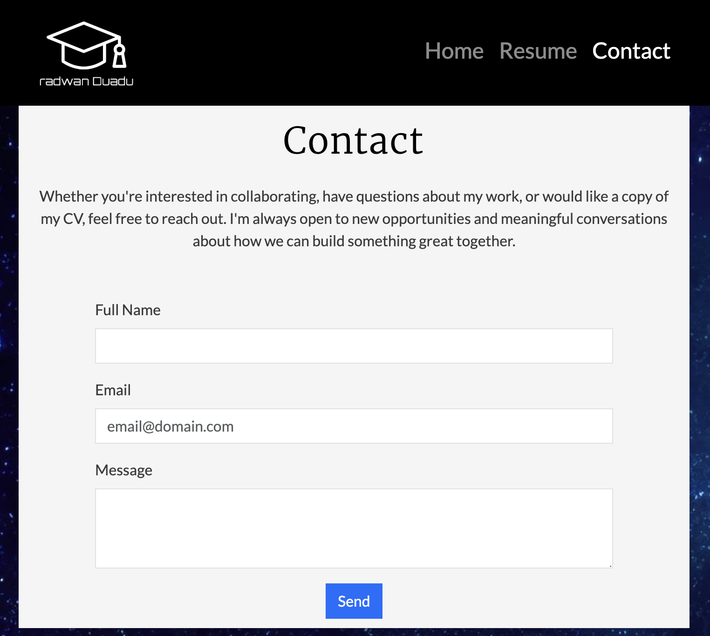
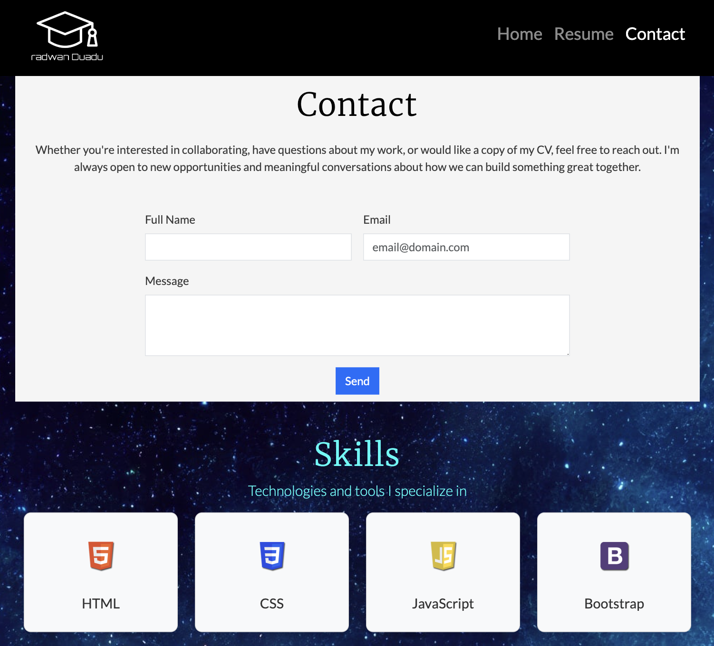
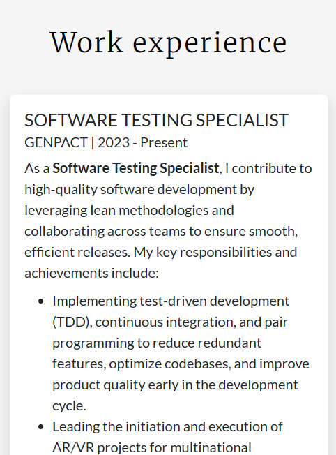
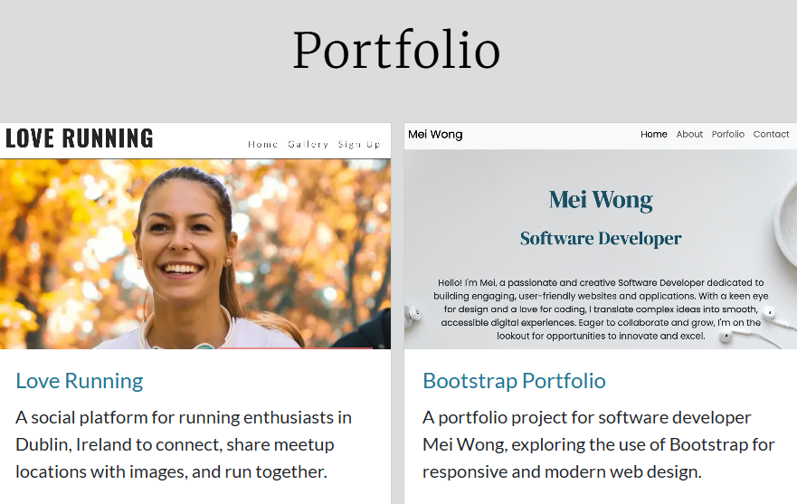
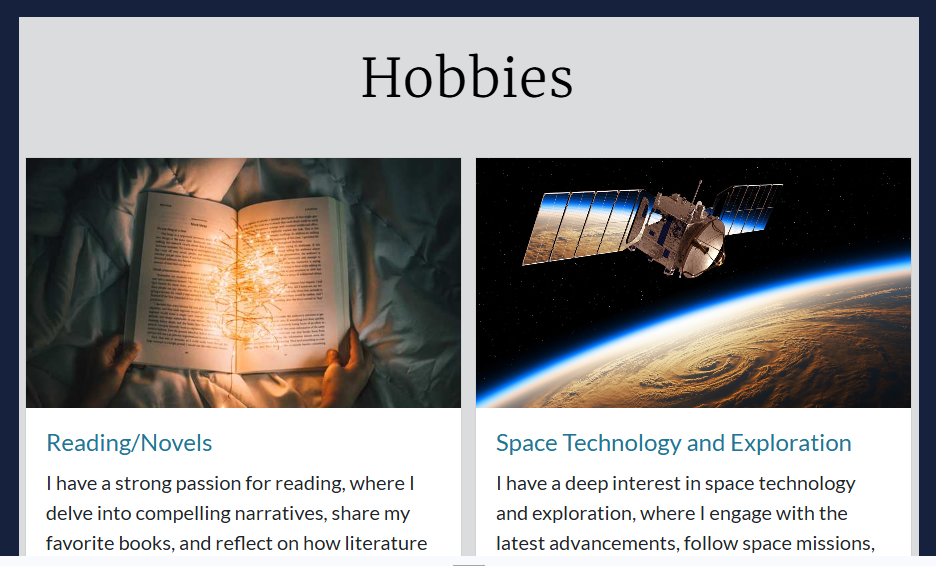
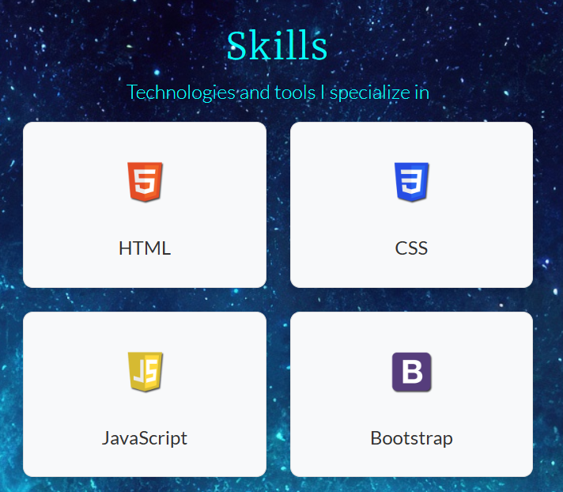

# Testing

> [!NOTE]
> Return back to the [README.md](README.md) file.

The following section outlines the testing, validation, and final results of the project. It details how each feature was verified for functionality, compatibility, and responsiveness.

## Code Validation

The following section presents the validation of all custom code files used in this project. Each file has been tested for syntax accuracy and standards compliance, with supporting screenshots provided as evidence.

### HTML

I have used the recommended [HTML W3C Validator](https://validator.w3.org) to validate all of my HTML files.

| Directory | File | URL | Screenshot | Notes |
| --- | --- | --- | --- | --- |
|  | [404.html](https://github.com/RadwanDuadu/radwan-portfolio/blob/main/404.html) | [HTML Validator](https://validator.w3.org/nu/?doc=https://radwanduadu.github.io/radwan-portfolio/404.html) |  | No errors detected |
|  | [contact.html](https://github.com/RadwanDuadu/radwan-portfolio/blob/main/contact.html) | [HTML Validator](https://validator.w3.org/nu/?doc=https://radwanduadu.github.io/radwan-portfolio/contact.html) |  | No errors detected |
|  | [index.html](https://github.com/RadwanDuadu/radwan-portfolio/blob/main/index.html) | [HTML Validator](https://validator.w3.org/nu/?doc=https://radwanduadu.github.io/radwan-portfolio/index.html) |  | No errors detected |
|  | [resume.html](https://github.com/RadwanDuadu/radwan-portfolio/blob/main/resume.html) | [HTML Validator](https://validator.w3.org/nu/?doc=https://radwanduadu.github.io/radwan-portfolio/resume.html) |  | No errors detected |

### CSS

I have used the recommended [CSS Jigsaw Validator](https://jigsaw.w3.org/css-validator) to validate all of my CSS files.

| Directory | File | URL | Screenshot | Notes |
| --- | --- | --- | --- | --- |
| assets | [style.css](https://github.com/RadwanDuadu/radwan-portfolio/blob/main/assets/css/style.css) | [CSS Validator](https://jigsaw.w3.org/css-validator/validator?uri=https://radwanduadu.github.io/radwan-portfolio) |  | No errors detected |

## Responsiveness

I've tested my deployed project to check for responsiveness issues.

| Page | Mobile | Tablet | Desktop | Notes |
| --- | --- | --- | --- | --- |
| Home |  |  |  | Works as expected |
| Resume |  |  |  | Works as expected |
| Contact |  |  |  | Works as expected |
| 404 |  |  |  | Works as expected |

## Browser Compatibility

I've tested my deployed project on multiple browsers to check for compatibility issues.

| Page | Chrome | Firefox | Safari | Notes |
| --- | --- | --- | --- | --- |
| Home |  |  |  | Works as expected |
| Resume |  |  |  | Works as expected |
| Contact |  |  |  | Works as expected |
| 404 |  |  |  | Works as expected |

## Lighthouse Audit

I've tested my deployed project using the Lighthouse Audit tool to check for any major issues. Some warnings are outside of my control, and mobile results tend to be lower than desktop.

| Page | Mobile | Desktop |
| --- | --- | --- |
| Home |  |  |
| Resume |  |  |
| Contact |  |  |
| 404 |  |  |

## Defensive Programming

Defensive programming was manually tested with the below user acceptance testing:

| Page/Section | Expectation | Test | Result | Screenshot |
| --- | --- |  --- |  --- |  --- |
| Home | This feature displays the user's bio and a brief "About Me" section, including hobbies and interests. It gives visitors to the portfolio a quick insight into the user's personality and background. | Verified that the bio, about me, and hobbies sections display content clearly and accurately as intended. | The bio, about me, and hobbies sections function correctly |  |
| | Feature is expected to have accessible navigation links. | Checked navigation links for correct functionality and accessibility. | Navigation links were functional and accessible. |  |
| | Feature is expected to be fully responsive. | Resized the browser window and tested on multiple devices (mobile, tablet, desktop). | The page was responsive across all tested screen sizes. |  |
| About Me | The "About Me" section should feature an avatar image accompanied by a brief overview of the individual's professional background and technical expertise. | Confirmed that the page contains a section with avatar image and short desciption. | About me section was displayed as expected. |  |
| Work Experience | The "Work Experience" section should feature previous work history accompanied by a brief overview of the work history. | Confirm that the work exepierence is displayed in appropriate format and responsive to different screen size.  | Work experience is displayed as expected |  |
| Hobbies | Feature is expected to display hobies of Radwan Duadu | Verified that the page lists upcoming events with relevant details. | Event details were displayed as expected. |  |
| Portfolio | The Project Portfolio feature is expected to present three completed projects using Bootstrap cards. Each card should include an image, brief description, and a link to the relevant GitHub repository or live site. | Each card was checked to ensure the image displays correctly, text is clear, and external links work as intended. | All project cards rendered correctly across devices, maintaining visual consistency and responsive behavior. Links were functional and content accurately reflected Radwan Duadu’s technical strengths and previous work. |  |
| Skills | Feature is expected to display skills and technolgies proficiency | Verified that the page lists user programming language and technologies | skills section displays skills in a clear and readable format |  |
| Contact Form | Feature is expected to prevent submission of an empty form. | Attempted to submit the form without filling any fields. | Form submission was blocked, as expected. |  |
| | Feature is expected to enforce valid input types for each field. | Entered invalid data (e.g., random text in an email field, numbers in a name field, etc.). | Error messages were displayed appropriately, and submission was blocked. |  |
| Social Links | Feature is expected to include working links to the club’s social platforms (Instagram, Facebook, etc.). | Clicked each social link to verify redirection to the correct platform page. | All links redirected to the correct platform pages, opening in new browser tabs. |  |
| 404 Error Page | Feature is expected to display a 404 error page for non-existent pages. | Navigated to an invalid URL (e.g., `/test`) to test error handling. | A custom 404 error page was displayed as expected. |  |

## User Story Testing

| Target | Expectation | Outcome | Screenshot | 
| --- | --- | --- | --- | 
| As a visitor |  I want to learn about the portfolio owner on the homepage so that I can understand their background and expertise | The home page includes an About Me section with a brief bio and an engaging introduction |  | 
| As a Visitor |  I need easy navigation and a user-friendly design, including a responsive layout for my device, so I can find information quickly and efficiently without frustration. | Site layout and navigation are intuitive, allowing easy access to different sections. |  |
| As a Visitor | I want to view the portfolio owner's resume, including work experience, so that I can assess their qualifications. | The Resume page includes past work experience, education, and relevant skills. |  | 
| As a Visitor | I want to contact the portfolio owner through a contact form so that I can reach out for potential opportunities. | The contact page includes a contact form with fields for name, email, and message. |  | 
| As a Visitor |  I want to see a visually appealing hero image with a short one-sentence bio so that I can quickly understand who the portfolio owner is. | A high-quality hero image is displayed prominently, and a brief bio is visible on the home page. |  | 
| As a Visitor | I want to see a footer on all pages containing social media icons that link to the portfolio owner's external profiles so that I can connect with them on different platforms. | The footer includes social media icons that open in new tabs and display correctly on all screen sizes with appropriate alt text. |  | 
| As a Visitor | I want to see the portfolio owner's completed projects so that I can evaluate their work and explore it further. | The Resume page includes a section that showcases projects in card format, each containing an image, title, and short description. Clicking the card redirects to the project's GitHub or live site. |  | 
| As a Visitor | I want to learn about the portfolio owner's hobbies so that I can connect with their interests and explore more about them. | The website features a hobbies section with individual cards that display a title or summary, link to external websites for more information, and are styled consistently and responsively across all screen sizes. |  | 
| As a Visitor | I want to view the portfolio owner's technical skills and tools in the Contact section so that I can quickly assess their areas of expertise before reaching out.| The Contact section includes a visually styled skills grid with icons and labels to display the user's key technologies (e.g., HTML, CSS, JavaScript, Bootstrap, Git, GitHub, etc.).|  |
| As a Visitor | I want to be redirected to a custom 404 page when I enter a non-existent URL so that I receive a relevant and personal message instead of a default error page. | A custom 404.html page exists and provides a personal message with navigation options. |  |
| As a Devloper | I want my HTML code to pass the W3C validation with no issues so that I ensure proper coding standards. | No validation errors in the Validator for HTML code.|  |
| As a Devloper | I want my CSS code to pass the W3C validation with no issues so that I ensure proper coding standards. | No validation errors in the Validator for CSS code.|  |

## Bugs

### Fixed Bugs

I've used [GitHub Issues](https://www.github.com/RadwanDuadu/radwan-portfolio/issues) to track and manage bugs and issues during the development stages of my project.

All previously closed/fixed bugs can be tracked [here](https://www.github.com/RadwanDuadu/radwan-portfolio/issues?q=is%3Aissue+is%3Aclosed+label%3Abug).

### Unfixed Bugs

Any remaining open issues can be tracked [here](https://www.github.com/RadwanDuadu/radwan-portfolio/issues).

### Known Issues

| Issue | Screenshot |
| --- | --- |
| When validating CSS style file, the validator warns about multiple external warnings. This is acceptable. |  |

> [!IMPORTANT]
> There are no remaining bugs that I am aware of, though, even after thorough testing, I cannot rule out the possibility.